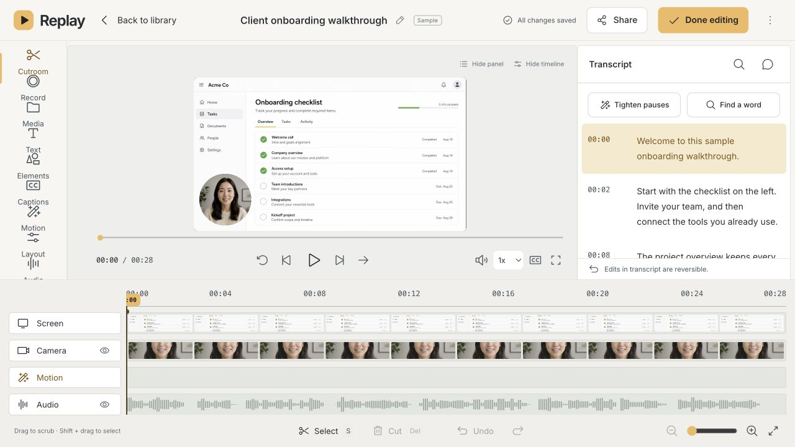
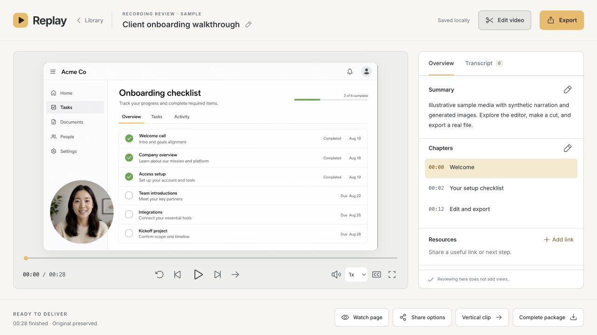
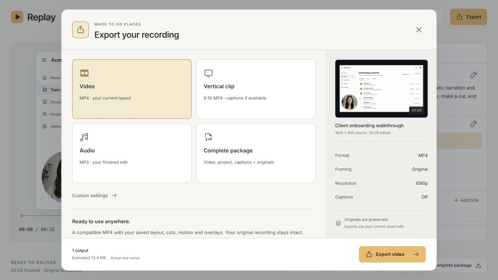

# Replay

Record your screen in your browser, edit the recording, and export a finished video. Replay runs on your own computer. Your library and media stay local unless you explicitly use an optional AI action.

## Easiest setup: ChatGPT Work

1. **Download the files.** [Download Replay as a ZIP](https://github.com/justynberk/replay/archive/refs/heads/main.zip) and unzip it.
2. **Drag the extracted folder into ChatGPT Work** in the ChatGPT desktop app. Give it access to the local folder so it can install and run Replay.
3. **Say: "Hey, run this app for me."**

Follow any setup prompts, then open the browser link it gives you. If you need to attach the folder manually, use **Edit project > Add folder** in your project's menu.

Prefer the terminal? Follow the [requirements](#requirements) and [install instructions](#install-and-run) below.

**Browser-based local beta.** Install the source, start the local service, and open Replay in a desktop browser. No native app, account or API key is required for recording, editing or exporting. Viewer links work on your computer; they are not public internet links.



*Actual Replay interface using the bundled illustrative sample.*

## Requirements

- **Node.js 24 LTS recommended**, with npm included. Minimum: Node.js 22.12. Download the installer from [Node.js](https://nodejs.org/en/download). Reopen your terminal after installing.
- **FFmpeg and ffprobe** available in your terminal, with the common video/audio encoders. `npm run doctor` checks these before you record.
- **A desktop browser with screen capture.** Start with Chrome or Edge. Screen, camera, microphone and system-audio availability depends on the browser, OS and selected source. See [browser support](#browser-support).
- Space for your original recordings and rendered exports. Exports can temporarily need several times the source file size.

### Install FFmpeg

**macOS**, if you already use [Homebrew](https://brew.sh/):

```sh
brew install ffmpeg
```

**Ubuntu or Debian:**

```sh
sudo apt update
sudo apt install ffmpeg fonts-dejavu-core
```

**Windows:** download a full Windows build linked from the [FFmpeg downloads page](https://ffmpeg.org/download.html). Extract it and add its `bin` folder, containing `ffmpeg.exe` and `ffprobe.exe`, to your user PATH. Reopen the terminal. That page also lists builds for other operating systems.

Check the installation:

```sh
node --version
npm --version
ffmpeg -version
ffprobe -version
```

If the FFmpeg commands are not found, fix PATH or configure the full executable paths in `app/.env` using `app/.env.example`.

## Install and run

Download this repository using **Code > Download ZIP** on GitHub and extract it, or clone it using the repository's **Code** URL. Open a terminal in the extracted repo folder, the one containing this README and `package.json`.

```sh
npm ci
npm start
```

Or clone and install directly:

```sh
git clone https://github.com/justynberk/replay.git
cd replay
npm ci
npm start
```

Open **http://127.0.0.1:4317** when the terminal says **Replay is ready**. Keep that terminal open while using Replay. Press **Ctrl+C** to stop it. Next time, open the same folder and run `npm start` again.

Startup checks dependencies and ports, builds the browser interface and starts the local recorder service plus its separate viewer. The first run also prepares an illustrative sample, which may take a little longer. You do not need to run a separate build or development server.

The sample uses generated images and synthetic narration where available. Import your own video or choose **Record** to create a real recording.

## Your first recording

1. Open **Record** and choose screen, camera and microphone options.
2. Start source setup, grant the requested permissions and choose a screen, window or tab. Enable audio in the browser's share picker if it offers that option.
3. Record a short clip, stop and save it.
4. Review it, choose **Edit video**, and make a trim or add a caption.
5. Export **Video**, then open the downloaded MP4 to check the result.

Optional AI actions require your own provider key. Copy `app/.env.example` to `app/.env`, add `OPENAI_API_KEY` and restart. Transcription sends audio; AI summaries send transcript text only when you request those actions. Provider charges may apply. Recording and editing work without this configuration. Never commit your `.env` or put keys in browser code.

## Browser support

Chrome and Edge are the initial desktop testing targets. Their listing here is not a claim that every browser/OS/device combination has been verified. Firefox and Safari may offer different capture and audio capabilities; mobile browsers are not a supported recording target for this beta.

Screen sharing needs an explicit browser permission prompt for each session. On macOS, you may also need to allow your browser under **System Settings > Privacy & Security > Screen & System Audio Recording**, Camera and Microphone, then restart the browser. OS wording varies by version.

Sharing a tab, a window and an entire screen can expose different audio choices. Replay cannot capture system sound if the browser does not supply it. Requested resolution and frame rate are preferences; inspect the actual source information in setup. See the [browser screen-capture documentation](https://developer.mozilla.org/en-US/docs/Web/API/MediaDevices/getDisplayMedia) for platform-dependent restrictions.

Automated tests exercise synthetic media, actual FFmpeg exports, saved edits and viewer isolation. Physical camera/microphone permissions, system audio and interruption recovery still need manual testing on each supported browser/OS combination. CI configuration includes macOS, Linux and Windows; a configured workflow is not evidence that those runs passed.

## Recordings, backups and updates

By default, recordings, edits, exports, viewer discussions and analytics live in **`app/.replay-data/`**. This hidden folder is excluded from Git and release packages. Archiving a recording keeps its files.

**Before updating, stop Replay and back up the entire `app/.replay-data/` folder and your private `app/.env`, if present.** Restore them into the same locations in the new download before starting it. For a Git checkout, pull the update after backing up, then run `npm ci` and `npm start`. Do not delete your old download until the updated app shows your recordings and plays them correctly.

For storage outside the downloaded folder, set `REPLAY_DATA_DIR` in `app/.env` to an absolute path. Stop Replay, copy the full existing data folder to that location, configure the path, then restart. Example values:

```dotenv
# macOS or Linux example; replace with your own full path:
REPLAY_DATA_DIR=/path/to/ReplayData
# Windows example (forward slashes work):
# REPLAY_DATA_DIR=C:/Users/YourName/Videos/ReplayData
```

If the configured folder is empty, Replay opens a new library. Keep the original data until you confirm the copied library. Recording recovery drafts live separately in that browser's IndexedDB; keep using the same browser and exact Replay address. Clearing browser storage clears unsaved drafts. A video export package is not a full library backup.

## Troubleshooting

| Problem | What to do |
| --- | --- |
| `node` or `npm` is not recognized | Install Node.js, reopen the terminal, and check `node --version`. |
| Missing dependency or native canvas error | Use a supported Node version and run `npm ci` again. Do not copy `node_modules` between computers or operating systems. |
| FFmpeg or an encoder is missing | Install a full FFmpeg build, reopen the terminal, and run `npm run doctor`. |
| Port is already in use | Stop your other Replay terminal with Ctrl+C. Replay uses 4317 and 4319; development also uses 4318. No other process is stopped automatically. |
| Old `.env` has `REPLAY_PORT=4318` | Remove that line. Normal startup serves the app and API together on 4317. |
| The page cannot connect | Wait for “Replay is ready” and keep the terminal running. Use `http://127.0.0.1:4317`. |
| No permission prompt or black capture | Check browser and OS permissions, restart the browser if needed, then select a source again. |
| No system audio | Try sharing a browser tab and enable the picker's audio option if available. Support varies by browser and source. |
| An export was interrupted | Restart Replay and retry the export. Originals and saved edits remain in your library. |
| A viewer link fails on another computer | Viewer links are local. Send an exported file or handoff ZIP instead. |

Imports have a 4 GB per-file limit. GIF exports are limited to two minutes. Exports run one at a time. Internet hosting, multi-user accounts and cloud storage are not included. Never expose the owner service through a tunnel or port forwarding.

## Screenshots

Review your recording, chapters and summary:



Export video, a vertical clip, audio or a complete handoff package:



These are screenshots of the running app. The sample screen and presenter are generated illustrations, not personal recordings.

## Development

```sh
npm run doctor
npm run dev
npm test
npm run build
```

`npm run dev` uses a live-reloading frontend on 4317, owner API on 4318 and isolated viewer on 4319. Stop normal startup before running development. Viewer UI changes require rebuilding or restarting development. All services bind to loopback.

`npm run build` also preserves the existing static Sites packaging contract. That static output alone does not provide the recording or export backend.

See [all workflows](docs/FEATURES.md), the [release checklist](docs/RELEASE-CHECKLIST.md), [changelog](CHANGELOG.md) and [third-party notices](THIRD_PARTY_NOTICES.md). Replay's code is [MIT licensed](LICENSE).
